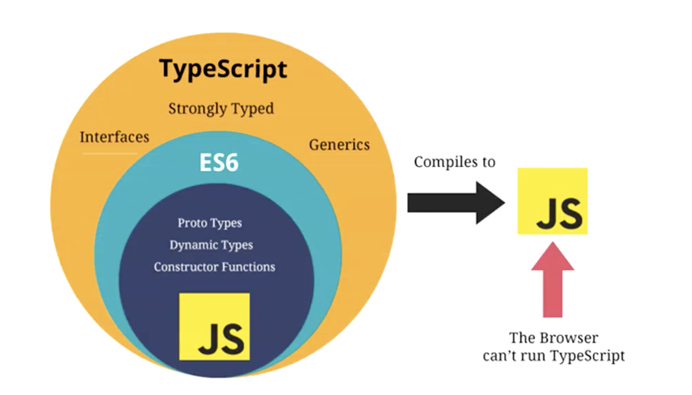

# plus：mac常用快捷键

## 工具类

* `shift + control + command + 4`：截图一个区域到粘贴板

## 编程类

* `commond + 方向键`：光标快速移动至（文件最上方/文件最下方/行末/行首）——（上/下/左/右）
* `option + ⬅️`：光标移动至单词的开头
* `option + ➡️`：光标移动至单词的末尾

* `shift + option + ➡️`：向右选中至当前行（词语）末尾
* `shift + option + ⬅️`：向右选中至当前行（词语）首

# TS设计背景

开发中的共识：**错误出现的越早越好(编写时>>编译时>>运行时)**，js不能进行类型检测（类型缺失），导致在运行时才能发现类型错误——>TypeScript：开发时进行类型检测

* ts不光为js带来类型检测，增加开发安全性；
* ts增加大型项目的可读性，可维护性

* 同时支持所有js语法，一些js新特性更是领先js的，所以是js的完全加强版

# 配置ts运行环境

`npm i typescript -g`

`tsc --version`

# Ts基本使用  

~~~typescript
let message: string = "hello"
/*
	1. 变量:类型
	2. string类型是typescript为我们提供的字符串类型，而String是js中的一个构造函数（类），所以一般使用string
*/
~~~

`tsc xxx.ts`：编译ts代码为js代码

`npm install tslib @types/node -g` 安装完这两个包之后就可以使用`ts-node xxx.ts`执行ts文件了

# 变量的声明

`var/let/const 标识符: 数据类型 = 赋值;`：变量后的数据类型又称之为“类型注解”（Type Annotation）

ts中不推荐使用`var`进行变量声明

## 类型推导

如果在变量声明时进行赋值，那么会自动进行类型推导：

~~~typescript
let name = "why"; // 自动推导出name应为string类型

name = 123; // 报错
~~~

* 如果`let`声明变量，推导出来的类型是通用类型
* 如果用`const`声明变量，推导出来的是字面量类型

~~~typescript
const height = 1.88; // height就是1.88类型
~~~

# js与ts的数据类型

ts是js的超集：

* `number`
* `boolean`
* `string`

## 数组类型

注意事项：真实的开发中，数组一般存放相同的数据类型（利于对数据进行统一处理）

~~~typescript
let name: string[] = ["abc", "cba", "nba"]; // 数组类型，且数组中存放字符串
/*
	等价写法
*/
let nums: Array<number> = [123, 321, 111]; // 数组类型，且数组中存放数字number
~~~

## Object类型

~~~typescript
let info: {
  name: string,
  age: number,
  height: number
} = {
  name: "why",
  age: 18,
  height: 1.88
}
~~~

当然也可以用`type`或者`interface`限制对象类型，后面再学

不要写：`let info: object = ...`，这样代表info是一个空对象（后面我们使用info时既不能访问内部属性，也不能设置属性）

## null && undefined

也是基本类型：

~~~typescript
let n: null = null;
let u: undefined = undefined;
~~~

## 函数的类型

### 函数参数

ts中定义一个函数时，需要明确的制定参数的类型：

~~~typescript
function sum(num1: number, num2: number) {
  return num1 + num2;
}
~~~

### 函数返回值

返回值类型可以明确制定，也可以自动进行类型推导

~~~typescript
function sum(num1: number, num2: number): number {
  return num1 + num2;
}
~~~

### 匿名函数的参数类型

一般来说**匿名函数的参数类型都会被上下文自动确定**，我们不要刻意去加类型注解：

~~~typescript
const name: string[] = ["avb", "sfdf", "hhh"];

// 不要写成：function(item: string, index: number, arr: string[])
names.forEach(function(item, index, arr) {
  ...
})
~~~

## 对象类型

~~~typescript
function printCoordinate(point: {x: number, y: number}) {
  console.log("x坐标：",point.x);
  console.log("y坐标：",point.y);
}
// 嫌point对象的类型注解太长了，可以用type起个别名，完全等价于：
type PointType = {x: number, y: number};
function printCoordinate(point: PointType) {
  console.log("x坐标：",point.x);
  console.log("y坐标：",point.y);
}
// 对象类型的注解中，属性之间也可以使用;进行分隔，例如：{x: number; y: number}，所以如果换行的话甚至可以不写分隔符（js特性：换行时自动补全分号）
~~~

### 可选属性

~~~typescript
function printCoordinate(point: {x: number, y: number, z?: number}) { ... } 
~~~

## any数据类型

any类型表示不限制变量的类型，并且**可以对该变量进行任意的操作（与unknown的区别）**，例如访问属性`.length`...（用any注解一个变量相当于ts中回到了js）

## unknown类型

表示不知道变量的类型（不对变量的类型进行限制），但是默认情况下不能对变量进行任何的操作（对其任何的操作都是非法的）：

~~~typescript
let foo: unknown = "aaa";
foo = 123; // 合法
console.log(foo.length) // 访问属性，非法
~~~

如果想操作（访问属性或者方法）unknown类型的变量，需要对其进行**类型缩小**，然后根据缩小后的类型进行对应（合法）的操作：
~~~typescript
let foo: unknown = "aaa";
if(typeof foo === "string") { // 使用typeof运算符进行类型缩小
  console.log(foo.length);
}
~~~

## void类型

出现场景：

TS中如果一个函数没有任何返回值，那么这个函数的返回值类型的类型注解就是`void`。（如果返回值是void类型，那么函数体中我们也可以显式`return undefined`，ts编译器允许这样做而已）

应用场景：

指定函数类型的返回值是void：

~~~typescript
type FooType = () => void;
const foo: FooType = () => {};
// 其实像foo函数，函数没有返回值，其实也没有必要去刻意指定其返回值为void，毕竟类型推导会指出其返回值为void

// 实际中的使用场景一般出现在：
type ExecFnType = (...args: any[]) => void;
function delayExecFn(fn: ExecFnType) {
  setTimeout(() => {
    fn("why", 18);
  }, 1000)
}
delayExecFn((name, age) => {
  console.log(name, age);
})
/*
	一个函数的参数为函数类型，我们一般会规定函数参数的类型，这时候会用到void
*/
~~~

注意（了解即可）：当基于上下文类型推导推导出返回类型为void的时候，并不会强制函数一定不能返回内容，就是说我们写`arr.forEach()`时，提示函数参数应为`(item: xxx, index: number, this: xxx) => void`，这里的void就是推导出来的，我们可以在函数体中`return`。